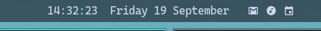

# Omarchy Hyprland Custom Configuration

Custom modifications for Omarchy's Hyprland setup including waybar app launchers, minimize/restore functionality, and YouTube Music integration.

## Screenshot



## Features

### 📱 Waybar App Launchers
Three minimal icons in waybar for quick app access:
- **Gmail** (󰊫)
- **YouTube Music** (󰎆)
- **Google Calendar** (󰃭)

Click to open/restore, click again to minimize to special workspace.

### 🎵 YouTube Music Integration
- Super+M keybind for quick access
- Opens as tiled window by default
- Toggle minimize/restore functionality

### ⚡ Special Workspace Management
- Apps minimize to special workspaces (hidden but still running)
- Smooth animations when restoring
- Maintains app state when minimized

## Files Included

### Hyprland
- `hypr/hyprland.conf` - Window rules and animations for YouTube Music
- `hypr/bindings.conf` - Custom keybinding for Super+M

### Waybar
- `waybar/config.jsonc` - App launcher modules configuration
- `waybar/style.css` - Styling for app icons (16px, matching theme)
- `waybar/scripts/app-toggle.sh` - Universal script for app minimize/restore
- `waybar/scripts/youtube-music-popup.sh` - YouTube Music specific handler

## Installation

1. Copy files to your config:
```bash
cp -r hypr/* ~/.config/hypr/
cp -r waybar/* ~/.config/waybar/
```

2. Make scripts executable:
```bash
chmod +x ~/.config/waybar/scripts/*.sh
```

3. Reload Hyprland:
```bash
hyprctl reload
```

4. Restart waybar:
```bash
pkill waybar && waybar &
```

## How It Works

The app toggle script (`app-toggle.sh`) manages window states:
1. First click: Opens app if not running
2. Second click: Minimizes to special workspace
3. Third click: Restores from special workspace

Apps remain running when minimized, preserving their state.

## Dependencies

- Hyprland
- Waybar
- Chromium (for web apps)
- jq (for JSON parsing in scripts)

## 🛠️ Customization Guide

This config is designed to be **easily adaptable** for your own apps and tools. Here's how to customize it:

### Adding Your Own Apps

1. **Edit the toggle script** (`waybar/scripts/app-toggle.sh`):
```bash
"notion")
    URL="https://notion.so"
    CLASS="webapp-notion"
    TITLE="Notion"
    ;;
"discord")
    URL="https://discord.com/app"
    CLASS="webapp-discord"
    TITLE="Discord"
    ;;
```

### Using Alternative Services (ProtonMail, Proton Calendar, etc.)

Replace Google services with privacy-focused alternatives by modifying the app-toggle.sh script:

```bash
# Example: Replace Gmail with ProtonMail
"mail")  # Changed from "gmail"
    URL="https://mail.proton.me"  # ProtonMail URL
    CLASS="webapp-protonmail"
    TITLE="ProtonMail"
    ;;

# Example: Replace Google Calendar with Proton Calendar
"calendar")
    URL="https://calendar.proton.me"  # Proton Calendar URL
    CLASS="webapp-protoncal"
    TITLE="Proton Calendar"
    ;;

# Example: Replace YouTube Music with Spotify
"music")  # Changed from "youtube-music"
    URL="https://open.spotify.com"
    CLASS="webapp-spotify"
    TITLE="Spotify"
    ;;
```

#### Other Privacy-Focused Alternatives:
```bash
# Tutanota (Email)
    URL="https://mail.tutanota.com"

# Fastmail (Email & Calendar)
    URL="https://app.fastmail.com"

# Tidal (Music)
    URL="https://listen.tidal.com"

# Apple Music (Web)
    URL="https://music.apple.com"
```

Then update waybar config to match your chosen service names:
```json
"custom/mail": {  // Generic name for any mail service
  "format": "󰊫",
  "tooltip-format": "Mail",
  "on-click": "~/.config/waybar/scripts/app-toggle.sh mail"
}
```

2. **Add waybar icon** in `waybar/config.jsonc`:
```json
"custom/notion": {
  "format": "󰈚",
  "tooltip-format": "Notion",
  "on-click": "~/.config/waybar/scripts/app-toggle.sh notion",
  "interval": "once"
}
```

3. **Include in waybar modules**:
```json
"modules-center": ["clock", "custom/gmail", "custom/notion", "custom/discord"]
```

### Using Native Apps Instead of Web Apps

For native applications, modify the script:
```bash
"code")
    # Skip URL, just set identifiers
    CLASS="Code"
    TITLE="Visual Studio Code"
    ;;
```

Then in the script's else block:
```bash
# For native apps, launch directly
if [ "$APP" = "code" ]; then
    code &
else
    # Web app logic
    chromium --class="$CLASS" --app="$URL" --new-window &
fi
```

### Changing Icons

Find your preferred icons at [Nerd Fonts Cheat Sheet](https://www.nerdfonts.com/cheat-sheet) and update the `format` field.

### Different Layouts

- **Vertical sidebar**: Move icons to `modules-left` or `modules-right`
- **More spacing**: Adjust margins in `waybar/style.css`
- **Different colors**: Customize the CSS color values

### Alternative Minimize Behavior

To change from special workspaces to other behaviors:
- **Close instead of minimize**: Replace `movetoworkspacesilent` with `closewindow`
- **Different workspace**: Change `special:$APP` to a specific workspace number
- **Floating mode**: Add `togglefloating` commands

## Notes

- Apps open as regular tiled windows (not floating)
- Uses Hyprland's default animations
- Special workspaces keep apps running in background